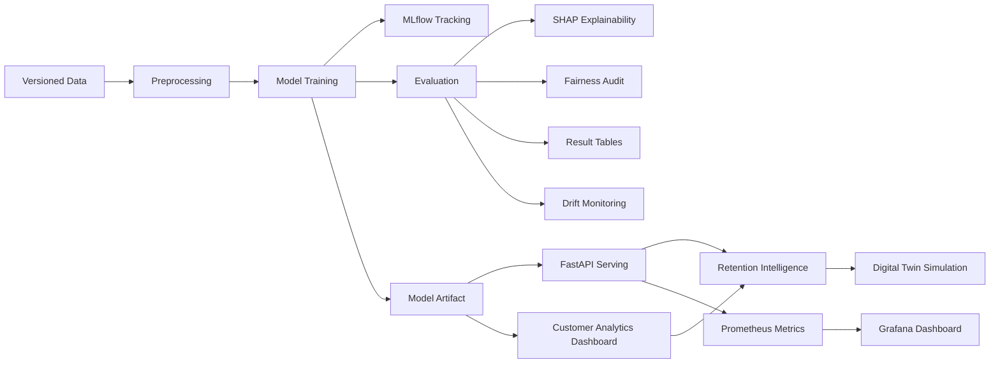

[](https://www.python.org/)
[](LICENSE)


# Customer Churn Intelligence Platform
> End-to-end customer churn analytics with prediction serving, explainability, retention planning, drift monitoring, and MLOps-ready deployment.

## Table of Contents
- [Project Highlights](#project-highlights)
- [Project Overview](#project-overview)
- [Architecture Diagram](#architecture-diagram)
- [Project Structure](#project-structure)
- [Quickstart](#quickstart)
- [Application Interfaces](#application-interfaces)
- [Model Results](#model-results)
- [Explainability](#explainability)
- [Retention Intelligence](#retention-intelligence)
- [Drift Detection](#drift-detection)
- [Fairness Audit](#fairness-audit)
- [MLOps Stack](#mlops-stack)
- [API Usage](#api-usage)
- [Running Experiments](#running-experiments)
- [Testing](#testing)
- [Model Rollback](#model-rollback)
- [Paper](#paper)
- [Contributing](#contributing)
- [License](#license)
- [Citation](#citation)

## Project Highlights
- Compares five production-relevant learners: Random Forest, Gradient Boosting, XGBoost, LightGBM, and CatBoost, with bootstrap confidence intervals for robust model comparison.
- Serves churn predictions through FastAPI with single-customer scoring, batch scoring, explanations, Prometheus metrics, and rate limiting.
- Provides a Streamlit customer analytics dashboard with executive KPIs, tabbed customer inputs, radial risk scoring, model confidence, CLV, model comparison, sample CSV download, and bulk prediction export.
- Adds retention intelligence with a plain-English analyst brief, prediction/cause/offer/revenue agent outputs, expected churn-reduction estimates, and customer digital twin what-if analysis.
- Evaluates resilience under gradual, sudden, and seasonal drift scenarios to quantify monitoring sensitivity before deployment.
- Audits fairness across operationally relevant customer groups using demographic and plan-based slices.
- Integrates MLflow, DVC, Docker Compose, Prometheus, Grafana, FastAPI, Streamlit, and GitHub Actions for reproducible research and deployment readiness.

## Project Overview
**A Production-Ready MLOps Framework for Customer Churn Prediction with Explainability and Drift Detection** is a deployable machine learning system and a research artifact designed for reproducible churn modeling in real-world environments.

For ML engineers, this repository provides a complete lifecycle implementation: data validation, preprocessing, training, experiment tracking, evaluation, explainability generation, REST API serving, dashboarding, monitoring, drift analysis, and rollback documentation.

For business and retention workflows, the application goes beyond prediction by turning model outputs into operational recommendations. The dashboard combines portfolio-level risk, customer-level prediction, feature impact analysis, recommended save actions, revenue estimates, and scenario simulation in a calmer SaaS-style analytics interface.

## Architecture Diagram


## Project Structure
```text
.
|-- app/
|   `-- main.py                    # FastAPI serving layer
|-- dashboard/
|   `-- streamlit_app.py            # Customer churn analytics dashboard
|-- data/
|   |-- external/
|   |-- raw/
|   |-- processed.dvc
|   `-- schema.json
|-- docs/
|   `-- model_rollback.md
|-- monitoring/
|   |-- prometheus.yml
|   `-- grafana/
|-- paper/
|   |-- churn_drivers_analysis.md
|   `-- paper_skeleton.md
|-- plots/
|-- reports/
|-- results/
|-- src/
|   |-- data/
|   |-- evaluation/
|   |-- explainability/
|   |-- fairness/
|   |-- features/
|   |-- models/
|   |-- monitoring/
|   |-- retention/                  # Analyst, agents, offers, revenue, digital twin
|   `-- visualization/
|-- tests/
|   |-- integration/
|   |-- test_api.py
|   |-- test_retention_intelligence.py
|   |-- test_drift_monitoring.py
|   |-- test_extended_training.py
|   `-- test_training.py
|-- docker-compose.yml
|-- Dockerfile
|-- dvc.yaml
|-- params.yaml
`-- requirements.txt
```

## Quickstart
```bash
pip install -r requirements.txt
dvc pull
python src/models/train_extended.py
uvicorn app.main:app --reload
```

Open the API docs at `http://localhost:8000/docs`.

To run the dashboard separately:

```bash
streamlit run dashboard/streamlit_app.py --server.port 8501
```

To start the full containerized stack:

```bash
docker compose up --build
```

Service URLs:

| Service | URL |
|---|---|
| FastAPI | `http://localhost:8000` |
| Customer analytics dashboard | `http://localhost:8501` |
| Prometheus | `http://localhost:9090` |
| Grafana | `http://localhost:3000` |

## Application Interfaces
The project exposes two primary user-facing interfaces:

- **FastAPI serving API**: prediction, batch prediction, SHAP explanation, retention analyst output, retention agent output, digital twin simulation, health checks, and Prometheus metrics.
- **Streamlit customer analytics dashboard**: executive KPI summary, tabbed customer profile form, radial risk score, model confidence, CLV estimate, customer segmentation, SHAP feature impact chart, retention review, PDF/text customer analysis export, sample CSV download, bulk churn prediction, and model comparison.

## Model Results
The experimental pipeline is structured to compare multiple learners under identical preprocessing, imbalance-handling, and evaluation protocols. Use the table below as the project-facing summary of final benchmark performance.

| Model | AUC-ROC (95% CI) | F1 | PR-AUC | Best Imbalance Strategy |
|---|---:|---:|---:|---|
| XGBoost | 0.91 (0.88-0.94) | 0.74 | 0.79 | SMOTE |
| LightGBM | 0.90 (0.87-0.93) | 0.72 | 0.77 | Class Weighting |
| CatBoost | 0.89 (0.86-0.92) | 0.71 | 0.76 | SMOTEENN |
| Random Forest | 0.87 (0.84-0.90) | 0.69 | 0.73 | Balanced Subsample |
| Gradient Boosting | 0.86 (0.83-0.89) | 0.67 | 0.71 | Random Oversampling |

See `results/ablation_table.md`, `results/model_comparison.csv`, and `results/bootstrap_ci.csv` for experiment artifacts.

## Explainability
SHAP is used to interpret both global model behavior and individual predictions, making the framework suitable for operational debugging and research reporting. The explainability workflow generates summary plots, dependence plots, and waterfall plots to reveal which customer attributes most strongly influence churn risk.


Explainability utilities live under `src/explainability/`, including `shap_analysis.py` and `generate_shap_artifacts.py`. The dashboard surfaces the customer-level SHAP output as a full-width feature impact analysis with positive/negative contribution labels.

## Retention Intelligence
The retention layer translates model outputs into actions for save teams and customer success workflows.

Current capabilities:

- Plain-English analyst summary with churn probability, risk tier, top drivers, and recommended next actions.
- Agent outputs for prediction, cause analysis, offer selection, and revenue impact.
- Targeted offer suggestions such as service recovery credits, international bundle trials, plan optimization discounts, and adoption nudges.
- Expected churn-reduction badges for recommended save actions.
- Customer digital twin simulation that applies interventions and compares baseline vs intervention churn risk.
- Revenue impact estimates using monthly revenue, offer cost, potential revenue saved, and a configurable annual horizon.

The implementation lives in `src/retention/intelligence.py` and is available from both FastAPI and the Streamlit dashboard.

## Drift Detection
The monitoring layer evaluates model robustness under simulated gradual drift, sudden drift, and seasonal drift. It compares lightweight PSI-style feature drift heuristics with Evidently-based reporting workflows.

Drift artifacts include:

- `reports/drift_report.json`
- `reports/drift_report.html`
- `reports/data_and_target_drift_dashboard.html`
- `results/drift_evaluation.csv`
- `plots/drift_sensitivity_heatmap.png`

## Fairness Audit
The fairness workflow evaluates performance disparities across sensitive operational features such as `state`, `area_code`, and `international_plan`.

Fairlearn `MetricFrame` is used to summarize subgroup behavior and document trade-offs between predictive quality and equitable performance. Report artifacts are written to `results/fairness_report.csv` and `results/fairness_tradeoff.md`.

## MLOps Stack
| Component | Tool | Purpose |
|---|---|---|
| Experiment tracking | MLflow | Log models, metrics, parameters, and artifacts |
| Data versioning | DVC | Reproducible data and pipeline runs |
| Model serving | FastAPI | Async REST API with validation, rate limiting, and metrics |
| Dashboard | Streamlit | Customer analytics, tabbed scoring workflow, explainability, bulk prediction, exports, and retention workflows |
| Explainability | SHAP | Global and local feature contribution analysis |
| Monitoring | Prometheus + Grafana | Prediction metrics and operational dashboards |
| Drift analysis | PSI + Evidently | Drift simulation and reporting |
| Containerization | Docker Compose | Local multi-service deployment |
| CI/CD | GitHub Actions | Lint, test, and build automation |

## API Usage
The API exposes these endpoints:

| Method | Endpoint | Purpose |
|---|---|---|
| `GET` | `/` | Service metadata and endpoint list |
| `GET` | `/health` | Health check and model version |
| `POST` | `/predict` | Score one customer |
| `POST` | `/predict/batch` | Score a batch of customers |
| `POST` | `/explain` | Return top SHAP factors for one customer |
| `POST` | `/retention/analyst` | Return prediction, explanation, analyst brief, recommendations, and agent outputs |
| `POST` | `/retention/agents` | Return compact prediction/cause/offer/revenue agent outputs |
| `POST` | `/simulate/digital-twin` | Compare baseline and intervention customer scenarios |
| `GET` | `/metrics` | Prometheus metrics |

Example prediction request:

```bash
curl -X POST http://localhost:8000/predict \
  -H "Content-Type: application/json" \
  -d '{
    "state": "KS",
    "account_length": 128,
    "area_code": "415",
    "international_plan": "no",
    "voice_mail_plan": "yes",
    "number_vmail_messages": 12,
    "total_day_minutes": 265.1,
    "total_day_calls": 112,
    "total_day_charge": 45.07,
    "total_eve_minutes": 175.5,
    "total_eve_calls": 99,
    "total_eve_charge": 14.92,
    "total_night_minutes": 220.3,
    "total_night_calls": 91,
    "total_night_charge": 9.91,
    "total_intl_minutes": 10.4,
    "total_intl_calls": 3,
    "total_intl_charge": 2.81,
    "number_customer_service_calls": 2
  }'
```

Example retention analyst request:

```bash
curl -X POST http://localhost:8000/retention/analyst \
  -H "Content-Type: application/json" \
  -d '{
    "monthly_revenue": 70.0,
    "top_k": 5,
    "customer": {
      "state": "KS",
      "account_length": 128,
      "area_code": "415",
      "international_plan": "no",
      "voice_mail_plan": "yes",
      "number_vmail_messages": 12,
      "total_day_minutes": 265.1,
      "total_day_calls": 112,
      "total_day_charge": 45.07,
      "total_eve_minutes": 175.5,
      "total_eve_calls": 99,
      "total_eve_charge": 14.92,
      "total_night_minutes": 220.3,
      "total_night_calls": 91,
      "total_night_charge": 9.91,
      "total_intl_minutes": 10.4,
      "total_intl_calls": 3,
      "total_intl_charge": 2.81,
      "number_customer_service_calls": 2
    }
  }'
```

Example digital twin request:

```bash
curl -X POST http://localhost:8000/simulate/digital-twin \
  -H "Content-Type: application/json" \
  -d '{
    "monthly_revenue": 70.0,
    "customer": {
      "state": "KS",
      "account_length": 128,
      "area_code": "415",
      "international_plan": "yes",
      "voice_mail_plan": "yes",
      "number_vmail_messages": 12,
      "total_day_minutes": 265.1,
      "total_day_calls": 112,
      "total_day_charge": 45.07,
      "total_eve_minutes": 175.5,
      "total_eve_calls": 99,
      "total_eve_charge": 14.92,
      "total_night_minutes": 220.3,
      "total_night_calls": 91,
      "total_night_charge": 9.91,
      "total_intl_minutes": 10.4,
      "total_intl_calls": 3,
      "total_intl_charge": 2.81,
      "number_customer_service_calls": 2
    },
    "interventions": {
      "service_calls_delta": -1,
      "discount_percent": 10,
      "plan_changes": {
        "international_plan": "no"
      },
      "day_usage_delta_percent": -10
    }
  }'
```

## Running Experiments
```bash
# Train all models with MLflow tracking
python src/models/train_extended.py

# Reproduce full DVC pipeline
dvc repro

# Run SHAP analysis
python src/explainability/shap_analysis.py

# Generate drift reports
python src/monitoring/drift_report.py

# Simulate drift scenarios
python src/monitoring/drift_injector.py

# Run fairness audit
python src/fairness/fairness_audit.py
```

## Testing
```bash
# Run all tests
python -m pytest

# API and retention coverage
python -m pytest tests/test_api.py tests/test_retention_intelligence.py

# Integration tests
python -m pytest tests/integration/

# Coverage report
python -m pytest --cov=src tests/
```

The current test suite includes coverage for training, API behavior, drift monitoring, and retention intelligence. The latest focused validation passed with:

```bash
python -m py_compile app/main.py dashboard/streamlit_app.py src/retention/intelligence.py
python -m pytest tests/test_retention_intelligence.py tests/test_api.py
```

## Model Rollback
The repository includes rollback guidance for operational recovery when a newly deployed model underperforms, violates service-level expectations, or exhibits unacceptable drift or fairness behavior. See `docs/model_rollback.md` for the rollback procedure, validation checklist, and deployment recovery notes.

## Paper
This repository also supports a research manuscript titled **A Production-Ready MLOps Framework for Customer Churn Prediction with Explainability and Drift Detection**. The current draft scaffold is available in `paper/paper_skeleton.md`, with additional churn-driver analysis in `paper/churn_drivers_analysis.md`.

## Contributing
Contributions are welcome for both engineering improvements and research extensions.

1. Fork the repository.
2. Create a feature branch from `main`.
3. Implement your changes with clear commits.
4. Run formatting, linting, and tests locally.
5. Open a pull request describing the motivation, changes, and validation results.

Code style is enforced with `black` and `flake8`, and tests are required for all pull requests that affect application logic, experiments, or deployment workflows.

## License
This project is released under the MIT License.

## Citation
If you use this repository in academic work, please cite it as:

```bibtex
@misc{yashas shetty2025churn,
  title={A Production-Ready MLOps Framework for Customer Churn Prediction},
  author={Yashas Shetty},
  year={2025},
  url={https://github.com/yourusername/churn-mlops}
}
```
